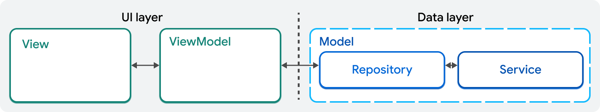

# twip_app

Додаток для будування маршрутів по місцях зображених на мапі [TWIP](https://twip.me).

## Як запустити проєкт
Після того як ви склонували репозиторій і встановили flutter потрібно:
- перейти в директорію проєкту (ту в якій лежить цей readme)
- встановити залежності вказані в [pubspec.yaml](./pubspec.yaml) виконавши команду:
`flutter pub get`
- виконати `dart run sqflite_common_ffi_web:setup` 
(щоб додаток міг працювати з бд в браузері - лекція 4)
- запустити додаток виконавши команду: `flutter run --web-port=1234`
- команда попросить обрати платформу на якій запускати додаток
- готово, можна дивитись на запущений проєкт.

## Архітектура проєкту
Проєкт побудований на основі архітектури MVVM (Model-View View Model).



Зображення взято зі сторінки [Guide to app architecture](https://docs.flutter.dev/app-architecture/guide#mvvm).

### Взаємозвʼязок структури проєкту з архітектурою MVVM

#### Структура UI layer в проєкті


Всі **UI компонети** знаходяться в **директорії ui**. Для кожної сторінки створюється 
окрема директорія. Компоненти, які використовуються на декількох сторінках 
одночасно можуть бути винесені в директорію **core**.

**View** - це реалізація зовнішнього виду. Цей шар нічого не знає про дані. 
Всі дані він бере з view-model. View нічого не знає про data шар, він ніколи 
не взаємодіє з репозиторіями чи сервісами напряму.

**View-Model** - це шар, який передає дані в View. Дані з data шару часто 
структуровані в не зручному для відображення форматі. 
View-model конвертує їх в зручний для відображеня вигляд.

Також на зображенні присутній **domain** шар і моделі в ньому. Це моделі, 
які передаються між UI i Data шарами. На діаграмі показані червоними 
стрілочками з підписом **"domain models"**. Вони не відносяться ні до UI, 
ні до Data шару тому винесені окремо. Більше інформації про моделі можна 
знайти в [/domain/models/RADME.md](./lib/domain/models/README.md).

Про **UI layer** детальніше можна почитати [тут](https://docs.flutter.dev/app-architecture/case-study/ui-layer).

#### Структура Data layer в проєкті


Всі компоненти **Data шару** розташовані в директорії **data**. 
Data шар відповідає за роботу з даними. В цьому шарі розміщені репозиторії 
(repositories) і сервіси (services). Сервіси і репозиторії **НЕ** потрібно 
групувати по сторінках, бо одні й ті ж дані часто використовуються 
на декількох сторінках одночасно.

**Сервіси** -  це **stateless** класи (тобто вони нічого не зберігають в собі), 
які використовуються для взаємодії з бекендом. Через те, що сервіси реалізують 
взаємодію з бекендом вони працюють з даними в такому виді як їх надає бекенд 
(API models на діаграмі). Ці API моделі повертаються в return в методах сервісів.  

Функціонал, який реалізовується в сервісах:
- отримання даних з якогось бекенду
- надсилання даних на збереження в бекенд
- опрацювання помилок, які стають над час надсилання запитів.


Часто спілкування з бекендом реалізовано з використанням [http](https://uk.wikipedia.org/wiki/HTTP) протоколу.
[REST](https://restfulapi.net/) - це популярна архітектура для проєктування 
http API (того як виглядатимуть запити).

Про [REST](https://restfulapi.net/):
- [REST Architectural Constraints](https://restfulapi.net/rest-architectural-constraints/) 
(стаття про вимоги до API, які роблять їх RESTful)
- [REST API URI Naming Conventions and Best Practices](https://restfulapi.net/resource-naming/) 
(стаття про те, що це ресурси і як їх називати, щоб вони відповідали REST)

**Репозиторії** відповідають за збереження даних на пристрої користувача.
В репозиторіях всі дані зберігаються в виді domain models.
Якщо дані отримані з **сервісу**, то вони приводяться в вигляд domain models, 
а вже потім повертаються з методів репозиторію.

Функціонал, який реалізовується в репозиторіях:
- зберігання локальних даних
- кешування даних з сервісу
- мапінг API моделей в domain моделі й навпаки.

Про **Data layer** детальніше можна почитати 
[тут](https://docs.flutter.dev/app-architecture/case-study/data-layer).

### Правила взаємодії компонентів додатку
Інформацію взято з [Communicating between layers](https://docs.flutter.dev/app-architecture/case-study/dependency-injection).

**View**
- знає тільки про View model 
- ніколи не взаємодіє з іншими компонентами.

**ViewModel**
- належить тільки одному View, який може використовувати його дані
- нічого не знає про Views
- знає про один або декілька репозиторіїв, які передаються в його конструктор
- нічого не знає про сервіси

**Repository**
- знає про один або декілька сервісів, які передаються в його конструктор
- може використовуватись багатьма View models
- нічого не знає ні про Views, ні про View models

**Service**
- може використовуватись багатьма репозиторіями
- нічого не знає ні про репозиторії, ні про Views і View models

### Додаткові модулі

#### Роутер
Для реалізації роутеру використовується залежність [go_router](https://pub.dev/packages/go_router).
Реалізація роутів в проєкті знаходиться в пакеті [routing](./lib/routing).

В файлі [routes.dart](./lib/routing/routes.dart) знаходяться константи з шляхами до сторінок.
Ці константи використовуються і в реалізації роутів в класі [router.dart](./lib/routing/router.dart)
і на сторінках де реалізовується перехід на іншу сторінку.

Для прикладу на сторінці [home](lib/ui/home/widgets/home_screen.dart) в рядку 48 ми переходимо на іншу сторінку. 
Параметром методу `context.push(...)` передається результат виклику методу 
`routeWithId` з файлу [routes.dart](./lib/routing/routes.dart).
```
context.push(
  Routes.routeWithId(widget.viewModel.routes[index].id),
)
```

**Важливо**: для того, щоб `context.push(...)` працював на сторінці де
він використовується має бути доданий `import 'package:go_router/go_router.dart';`

#### Dependency Injection (DI) context 
Для реалізації DI контексту використана залежність [provider](https://pub.dev/packages/provider).
Налаштування контексту знаходиться в пакеті [config](./lib/config).

Більше про DI буде додано згодом. 

